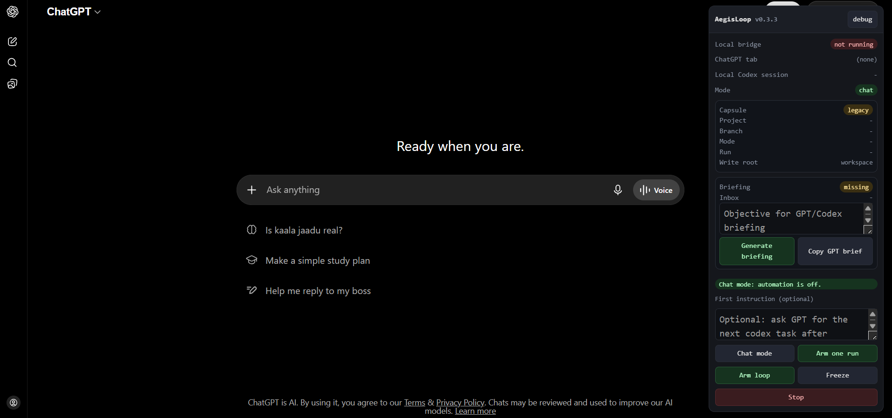
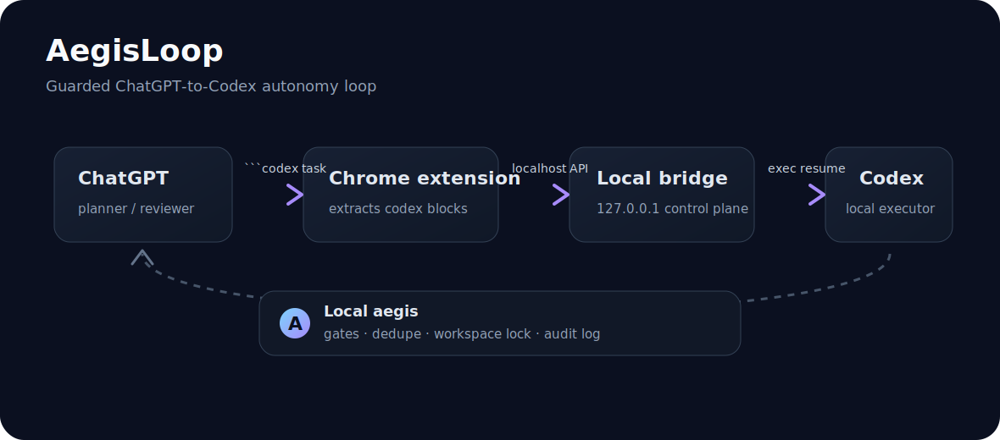

# AegisLoop

[](LICENSE)
[](https://github.com/MHW888888/aegisloop/actions/workflows/check.yml)
[](#safety-model)
[](#why-aegisloop)

> **Let ChatGPT plan a coding task while your local Codex executes it safely, one step at a time.**

AegisLoop connects a ChatGPT web conversation to a local Codex session. ChatGPT decides the next step, Codex runs it in your workspace, and AegisLoop carries the result back with local safety gates, workspace locks, dedupe, and audit logs.

It is for people who want useful agentic loops without handing the steering wheel to an unbounded web chat.

> AegisLoop is a personal automation bridge. It is not an official OpenAI product.

## Quick Demo

> Static screenshot of the Chrome extension panel (general panel overview / first demo screenshot). It is a sanitized onboarding image, so the version number and minor labels may lag behind the latest release. Key runtime states such as Chat Mode, Arm one run, Codex running, Needs approval, and Frozen will be documented in detail in subsequent updates. No real conversation IDs, tokens, local paths, or private workspace data are shown.



The extension panel exposes the local bridge status, briefing tools, chat mode controls, and the arm/freeze workflow used to safely start automation.



## AegisLoop Lite

Version `v0.2.0` focuses on first-run clarity:

- friendlier extension labels;
- a shorter setup path;
- beginner docs for common failures;
- clearer README positioning.

The goal: understand it in 30 seconds, run a first local loop in about 3 minutes.

## Current Focus: v0.3.x Hardening

Version `v0.3.9` makes the first run easier to understand and keeps the browser-to-bridge loop lighter on top of the v0.3 Parallel Safe Mode foundation:

- startup config schema validation, so bad `config.json` values fail fast with clear errors;
- Windows and macOS CI checks for the local setup scripts and core bridge tests;
- optional `X-AegisLoop-Token` auth for all `/api/*` bridge calls;
- explicit result `ACK` / `NACK`, so Codex results are not lost if ChatGPT insertion fails;
- clearer package, extension, and protocol version reporting;
- Run Capsule project / branch / run / mode shown in the extension panel;
- default Chat Mode, so normal Q&A is not interpreted as automation;
- explicit Arm one run / Arm loop buttons;
- per-arm nonce checks so old `codex` blocks cannot be resurrected accidentally;
- Dual Briefing templates separate the short ChatGPT planner brief from the detailed local Codex executor brief;
- the extension panel can generate Run Capsule `inbox` briefing files and copy the GPT thread brief;
- the panel now includes a four-step start guide and a **Use starter text** button for safer first tasks.
- Run Capsule runtime path segments preserve Unicode project / branch / run names while still replacing unsafe path characters.
- the extension now uses adaptive polling: faster checks while a run is active, slower checks while idle, and a DOM-change nudge when ChatGPT posts a new message.
- macOS / Windows Chrome seed confirmation is more tolerant: if the user-message bubble cannot be read back but a fresh nonce `codex` block appears, AegisLoop keeps the route armed and dispatches instead of falling back to Chat Mode. The confirmation window now waits long enough for slower model replies before pausing.

`/health` stays public for local checks. Sensitive APIs should use an `apiToken` when you run AegisLoop beyond a private throwaway setup.

## Why AegisLoop

ChatGPT is good at planning, critique, and next-step design. Codex is good at reading real files, making local changes, and running checks. AegisLoop connects them with a local control plane:

- ChatGPT emits exactly one fenced `codex` task.
- A local bridge dispatches that task to a bound Codex session.
- Codex runs locally in the configured workspace.
- The result is inserted back into ChatGPT.
- ChatGPT reviews and emits the next step.

The important part is not the loop itself. The important part is the **aegis** around it: gates, locks, dedupe, and logs.

## Who It Is For

| You are... | AegisLoop helps by... |
| --- | --- |
| using ChatGPT to plan multi-step coding work | avoiding repetitive copy/paste between ChatGPT and Codex |
| cautious about agents running local commands | adding pause, approval gates, workspace locks, and audit logs |
| running long engineering or research loops | returning each Codex result to ChatGPT for review |
| happy with the ChatGPT web UI | keeping ChatGPT as the planner instead of forcing a new IDE |

## What Makes It Different

| Problem | AegisLoop answer |
| --- | --- |
| ChatGPT cannot safely choose arbitrary local sessions | Bindings live in local `config.json`; web content cannot override them. |
| Web automation can loop forever | Missing `codex` blocks trigger bounded reformat nudges, then pause. |
| Two agents can corrupt one workspace | Same `workspaceDir` is serialized with a workspace lock. |
| Two research branches use the same stage names | Optional Run Capsules add `projectId`, `activeBranch`, `runId`, and an external write root. |
| Repeated model output can rerun the same task | Normalized content hash dedupe blocks repeated payloads. |
| Research workflows need hard boundaries | Local denylist gates block risky payloads before Codex runs. |
| Post-hoc debugging is painful | Every turn is written to JSONL audit logs. |

## Compared With Other Tools

| Tool | Main focus | AegisLoop difference |
| --- | --- | --- |
| Codex CLI | Local coding agent | AegisLoop keeps ChatGPT as planner and Codex as executor. |
| Aider | Git-native pair programming | AegisLoop focuses on browser-to-local loop orchestration. |
| OpenHands | Full agent platform | AegisLoop is smaller, local-first, and ChatGPT-page driven. |
| Nanobrowser | Browser automation | AegisLoop targets coding loops, not general web automation. |
| ai-dev-orchestrator | ChatGPT-to-local agent bridge | AegisLoop uses a Chrome extension plus local safety gates. |

## Quick Start

If you want the shortest safe path, start with the [3-minute Quickstart Card](docs/quickstart-card.md).

The short path:

1. Start the local bridge.
2. Open a ChatGPT conversation.
3. Keep the thread in **Chat Mode** until you are ready.
4. Click **Arm one run** for one safe dispatch, or **Arm loop** for a bounded loop.

For a step-by-step walkthrough, see [docs/first-run.md](docs/first-run.md).

If you are asking "what should I type first?", use the [Onboarding Playbook](docs/onboarding.md).

On macOS, use the dedicated [macOS setup guide](docs/macos.md). The short bridge command is:

```sh
npm start
```

For OS / browser / model compatibility, start with [docs/compatibility-matrix.md](docs/compatibility-matrix.md). For browser support beyond Chrome, see [docs/browser-compatibility.md](docs/browser-compatibility.md). Chrome is the primary target, Edge is the next recommended compatibility target, and Firefox/Tor should be treated as experimental until separately packaged and tested.

If a ChatGPT Pro or reasoning model says it cannot find the tool, see [docs/model-compatibility.md](docs/model-compatibility.md). AegisLoop does not use a built-in ChatGPT tool call; it reads a fenced `codex` JSON block from the page.

### 1. Clone

```powershell
git clone https://github.com/MHW888888/aegisloop.git
cd aegisloop
```

### 2. Configure

```powershell
Copy-Item .\config.example.json .\config.json
npm run doctor
```

Edit `config.json`:

- `conversationId`: id from the ChatGPT URL.
- `codexSessionId`: local Codex session id to resume.
- `workspaceDir`: local workspace for that session.
- `codex.bin` / `codex.args`: Node.js and Codex CLI paths.
- optional `apiToken`: when set, the Chrome extension must send this token to use bridge APIs.

Run `npm run doctor` again after editing `config.json`. It checks the common first-run mistakes without printing secrets.

### 3. Start The Bridge

```powershell
powershell -NoProfile -ExecutionPolicy Bypass -File .\launch.ps1
```

Check health:

```powershell
Invoke-RestMethod http://127.0.0.1:17380/health
```

If you set `apiToken`, save the same token in the extension panel when prompted.

If you change the bridge port from the default `17380`, also update **Local bridge URL** in the extension panel, for example `http://127.0.0.1:17400`.

### 4. Load The Chrome Extension

1. Open `chrome://extensions`.
2. Enable **Developer mode**.
3. Click **Load unpacked**.
4. Select `chrome-extension/`.
5. Open the bound ChatGPT conversation and press `Ctrl+F5`.

### 5. Run

If the page already contains a valid `codex` block, click:

```text
Arm one run
```

If there is no usable fresh `codex` block yet, type the first task in the AegisLoop panel and click **Arm one run** or **Arm loop**. AegisLoop will inject the current arm nonce into the protocol prompt.

## The Protocol

ChatGPT must end each actionable reply with exactly one fenced `codex` block:

````markdown
```codex
{"aegisloop":true,"arm_nonce":"aegis-YYYYMMDD-xxxx","prompt":"Read the current project state, make the smallest safe change, run checks, and report back."}
```
````

Or, if the loop should stop:

```text
<<<LOOP_STOP>>>
```

AegisLoop treats `<<<LOOP_STOP>>>` as a stop signal only when it is the whole assistant reply.

By default, each conversation is in **Chat Mode**. In Chat Mode, AegisLoop does not parse `codex` blocks, does not dispatch tasks, and does not send reformat nudges. Execution only starts after the user explicitly arms the conversation from the extension panel.

## Safety Model

AegisLoop does not trust web content to decide local authority.

If `apiToken` is set in `config.json`, every bridge endpoint under `/api/*` requires `X-AegisLoop-Token`. This prevents arbitrary local web pages from reading bindings or dispatching work through the bridge. Keep the token private and do not commit it.

The bridge can block payloads that appear to request:

- production signals
- scoring approval
- alpha evidence promotion
- trading advice or BUY/WATCH/AVOID style signals
- real-money orders
- price predictions
- git commit/push/merge/add
- weight changes

For parallel research runs, Run Capsules can also block ambiguous stage labels unless the prompt includes the configured `activeBranch`.

Codex results use an explicit ACK flow:

- `GET /api/result` returns a pending result without consuming it.
- `POST /api/result/ack` marks it consumed only after the extension confirms ChatGPT received the result.
- `POST /api/result/nack` keeps it pending and pauses the loop when insertion fails.

You can intentionally auto-approve selected low-risk gate rules:

```json
"autoApproveGateRules": ["approved_for_scoring"]
```

Use this carefully. The default design is research-first and fail-closed.

## Parallel Runs

You can bind multiple ChatGPT conversations.

If two conversations share the same `workspaceDir`, AegisLoop runs Codex jobs one at a time for that workspace. This is deliberate. It prevents concurrent writes from damaging files or git state.

For true parallelism, use separate git worktrees or separate workspace copies.

For safer multi-thread research runs, enable **Parallel Safe Mode** with a Run Capsule. It adds `projectId`, `activeBranch`, `runId`, and an external write root so two conversations can read the same source project without mixing branch context or output artifacts.

See [docs/parallel-safe-mode.md](docs/parallel-safe-mode.md).

For long-running runner threads, use **Dual Briefing**:

- paste the short `GPT_THREAD_BRIEF.md` into ChatGPT;
- keep `CODEX_EXECUTION_BRIEF.md`, `RESEARCH_RULES.md`, `FROZEN_BRANCHES.md`, and `CURRENT_OBJECTIVE.md` in the Run Capsule `inbox`;
- ask Codex to read the capsule and inbox files before executing.

See [docs/dual-briefing.md](docs/dual-briefing.md) and [templates/briefings/](templates/briefings/).

## Runtime Files

These files are local runtime state and are ignored by git:

- `config.json`
- `state.json`
- `logs/`
- `data/`
- `workspaces/`
- backup folders

## Community

- Launch copy: [docs/launch-posts.md](docs/launch-posts.md)
- Growth checklist: [docs/growth-checklist.md](docs/growth-checklist.md)
- Onboarding playbook: [docs/onboarding.md](docs/onboarding.md)
- First-run guide: [docs/first-run.md](docs/first-run.md)
- macOS setup: [docs/macos.md](docs/macos.md)
- Compatibility matrix: [docs/compatibility-matrix.md](docs/compatibility-matrix.md)
- Browser compatibility: [docs/browser-compatibility.md](docs/browser-compatibility.md)
- Model compatibility: [docs/model-compatibility.md](docs/model-compatibility.md)
- Troubleshooting: [docs/troubleshooting.md](docs/troubleshooting.md)
- Parallel Safe Mode: [docs/parallel-safe-mode.md](docs/parallel-safe-mode.md)
- Dual Briefing / 双端初始化: [docs/dual-briefing.md](docs/dual-briefing.md)
- Briefing templates: [templates/briefings/](templates/briefings/)
- v0.3.3 release notes: [docs/release-notes-v0.3.3.md](docs/release-notes-v0.3.3.md)
- v0.3.4 release notes: [docs/release-notes-v0.3.4.md](docs/release-notes-v0.3.4.md)
- v0.3.5 release notes: [docs/release-notes-v0.3.5.md](docs/release-notes-v0.3.5.md)
- v0.3.6 release notes: [docs/release-notes-v0.3.6.md](docs/release-notes-v0.3.6.md)
- v0.3.7 release notes: [docs/release-notes-v0.3.7.md](docs/release-notes-v0.3.7.md)
- v0.3.8 release notes: [docs/release-notes-v0.3.8.md](docs/release-notes-v0.3.8.md)
- v0.3.9 release notes: [docs/release-notes-v0.3.9.md](docs/release-notes-v0.3.9.md)
- Share kit / launch copy: [docs/share-kit.md](docs/share-kit.md)
- Growth checklist: [docs/growth-checklist.md](docs/growth-checklist.md)
- Launch post drafts: [docs/launch-posts.md](docs/launch-posts.md)
- Demo contributor issue pack: [docs/demo-issue-pack.md](docs/demo-issue-pack.md)
- Stability contributor issue pack: [docs/stability-issue-pack.md](docs/stability-issue-pack.md)
- Maintainer automation: [docs/maintainer-automation.md](docs/maintainer-automation.md)
- Contributing guide: [CONTRIBUTING.md](CONTRIBUTING.md)

## 中文说明

**AegisLoop** 是一个把 ChatGPT 网页对话和本地 Codex session 连接起来的本地优先自动化桥。ChatGPT 负责规划，本地 Codex 负责执行；AegisLoop 在中间加上安全闸门、运行胶囊、审计日志和显式授权。

典型流程：

```text
ChatGPT 规划下一步
  -> AegisLoop 转发给本地 Codex
  -> Codex 本地执行并回报
  -> AegisLoop 把结果贴回 ChatGPT
  -> ChatGPT 决定下一步或停止
```

关键设计：

- **默认 Chat Mode**：普通问答不会触发执行。
- **显式 Arm**：只有点击 Arm one run / Arm loop 后才执行。
- **Run Capsule**：每条执行线绑定 project、branch、run 和 external write root，减少支线串线。
- **Dual Briefing**：GPT 只拿短规划简报，Codex 在本地读取完整执行简报。
- **本地安全闸门**：越界 payload 会先被 bridge 拦截。
- **ACK/NACK 结果确认**：结果只有成功贴回 ChatGPT 后才标记为已消费。

如果你同时跑多个项目或多个研究分支，推荐使用：

```text
Discussion Thread = 正常问答，只讨论不执行
Runner Thread = 单一 active_branch，只执行
Archive Thread = 冻结支线，只保留状态
```

详细中英双语教程见 [docs/dual-briefing.md](docs/dual-briefing.md)。

## Roadmap

- Browser DOM selector hardening across ChatGPT UI variants.
- Optional repo-level branch/worktree manager.
- Local dashboard for queue, locks, and audit replay.
- Safer release packaging for the Chrome extension.

## License

MIT
