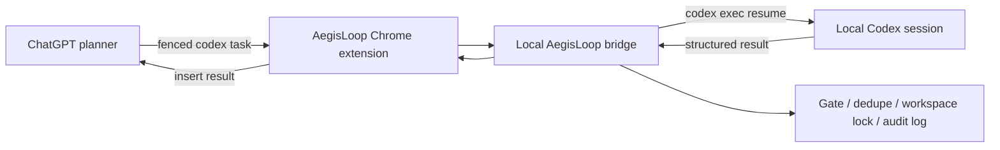

# AegisLoop

> **A guarded autonomy bridge for ChatGPT and local Codex.**

AegisLoop turns a ChatGPT web conversation into a bounded local engineering loop:
ChatGPT plans, Codex executes locally, AegisLoop carries results back, and local gates decide what is allowed to continue.

It is built for people who want autonomous coding/research loops without handing the steering wheel to an unbounded web chat.

> AegisLoop is a personal automation bridge. It is not an official OpenAI product.

## Why It Exists

Large language models are good at planning the next step. Local coding agents are good at touching real files, running checks, and reporting concrete results. AegisLoop connects those two roles while keeping the dangerous parts local and inspectable.



## Highlights

- **Conversation-bound execution**  
  Each ChatGPT conversation is bound to one local Codex session and one workspace.

- **Local-first control plane**  
  The bridge listens on `127.0.0.1`; ChatGPT cannot override session or workspace bindings.

- **Guarded autonomy**  
  Local denylist gates can block production signals, scoring approval, trading advice, git writes, real-money actions, price predictions, and other risky payloads.

- **Bounded recovery**  
  If ChatGPT forgets to emit a `codex` block, AegisLoop nudges it back to the protocol a limited number of times, then pauses.

- **Workspace lock**  
  Multiple conversations can be open, but writes to the same workspace are serialized to avoid corrupted files and git state.

- **Audit trail**  
  Every dispatch, gate, result, and stop event is written to JSONL.

## How The Loop Works

ChatGPT must end each actionable reply with exactly one fenced `codex` block:

````markdown
```codex
{"prompt":"Read the current project state, make the smallest safe change, run checks, and report back."}
```
````

Or, if the loop should stop:

```text
<<<LOOP_STOP>>>
```

AegisLoop reads that block, sends the prompt to the bound local Codex session, waits for the result, inserts it back into ChatGPT, and repeats.

## Installation

### 1. Clone or copy the project

```powershell
git clone https://github.com/YOUR_USER/aegisloop.git
cd aegisloop
```

### 2. Create your local config

```powershell
Copy-Item .\config.example.json .\config.json
```

Edit `config.json`:

- `conversationId`: the id from your ChatGPT URL.
- `codexSessionId`: the local Codex session id to resume.
- `workspaceDir`: the local workspace for that session.
- `codex.bin` / `codex.args`: your local Node.js and Codex CLI paths.

### 3. Start the bridge

```powershell
powershell -NoProfile -ExecutionPolicy Bypass -File .\launch.ps1
```

Check:

```powershell
Invoke-RestMethod http://127.0.0.1:17380/health
```

### 4. Load the Chrome extension

1. Open `chrome://extensions`.
2. Enable **Developer mode**.
3. Click **Load unpacked**.
4. Select `chrome-extension/`.

### 5. Start a loop

Open the bound ChatGPT conversation and press `Ctrl+F5`.

If the page already contains a valid `codex` block, click:

```text
Run current codex / start
```

If the page has no usable `codex` block yet, type the first task in the AegisLoop panel and start the loop.

## Configuration Notes

`config.json` is local-only and must not be committed.

Important fields:

```json
{
  "bindings": [
    {
      "conversationId": "YOUR_CHATGPT_CONVERSATION_ID",
      "codexSessionId": "YOUR_CODEX_SESSION_ID",
      "workspaceDir": "C:\\path\\to\\workspace",
      "fullAuto": true
    }
  ],
  "autoApproveGateRules": ["approved_for_scoring"]
}
```

`autoApproveGateRules` is optional. Use it only for gates you intentionally want to bypass locally.

## Parallel Runs

You can bind multiple ChatGPT conversations.

If two conversations share the same `workspaceDir`, AegisLoop runs Codex jobs one at a time for that workspace. This is deliberate. It prevents concurrent writes from damaging files or git state.

For true parallelism, use separate git worktrees or separate workspace copies.

## Runtime Files

The following files are local runtime state and are ignored by git:

- `config.json`
- `state.json`
- `logs/`
- `data/`
- `workspaces/`
- backup folders

## 中文说明

**AegisLoop** 是一个把 ChatGPT 网页对话和本地 Codex session 连接起来的“有护栏自动循环”工具。

它适合这样的工作流：

```text
ChatGPT 负责规划下一步
Codex 负责本地读文件 / 改文件 / 跑检查
AegisLoop 负责转发任务、回填结果、执行本地闸门
```

### 它解决什么问题

普通网页 ChatGPT 不能直接读你的本地项目，也不能可靠地持续驱动 Codex。  
Codex 能操作本地文件，但它需要明确的下一步任务。

AegisLoop 把两者接起来：

1. ChatGPT 输出一个 `codex` 指令块。
2. AegisLoop 把指令发给绑定的本地 Codex session。
3. Codex 在本地项目目录执行并输出结果。
4. AegisLoop 把结果贴回 ChatGPT。
5. ChatGPT 复盘并给下一条 `codex` 指令。

### 关键设计

- **绑定关系本地配置**：ChatGPT 不能自己改 `codexSessionId` 或 `workspaceDir`。
- **本地安全闸门**：越界指令会被拦截。
- **同目录串行执行**：两个线程写同一个项目时不会并发乱写。
- **结果可审计**：每轮都有 JSONL 日志。
- **停止需确认**：`<<<LOOP_STOP>>>` 会让循环暂停，而不是静默彻底终止。

### 使用步骤

1. 复制配置：

```powershell
Copy-Item .\config.example.json .\config.json
```

2. 修改 `config.json`，填入你的 ChatGPT conversation、Codex session、本地项目目录。

3. 启动 bridge：

```powershell
powershell -NoProfile -ExecutionPolicy Bypass -File .\launch.ps1
```

4. Chrome 加载 `chrome-extension/`。

5. 打开对应 ChatGPT 页面，按 `Ctrl+F5`。

6. 页面上已有 `codex` 块时，点击：

```text
Run current codex / start
```

### 关于同时跑多个线程

可以同时打开多个 ChatGPT 页面。  
但如果它们都写同一个项目目录，AegisLoop 会自动排队，保证同一时间只有一个 Codex 写入该目录。

如果你想真正并行，请给每条线单独的 git worktree 或项目副本。

## License

MIT
