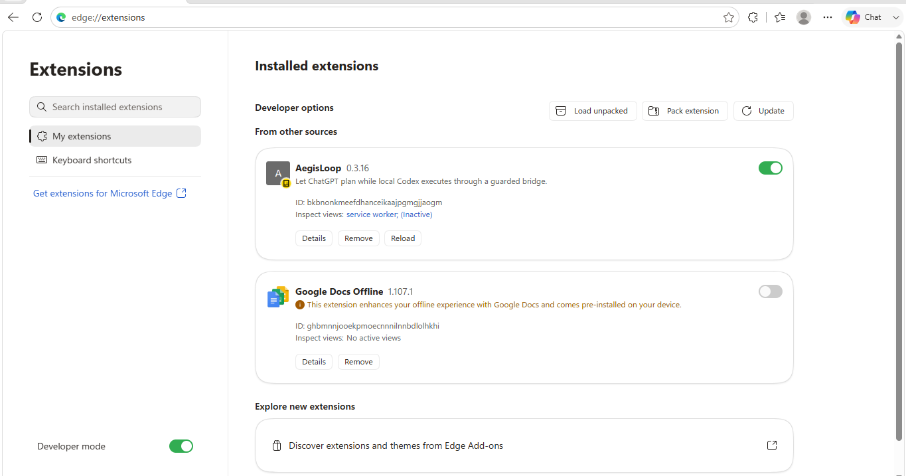
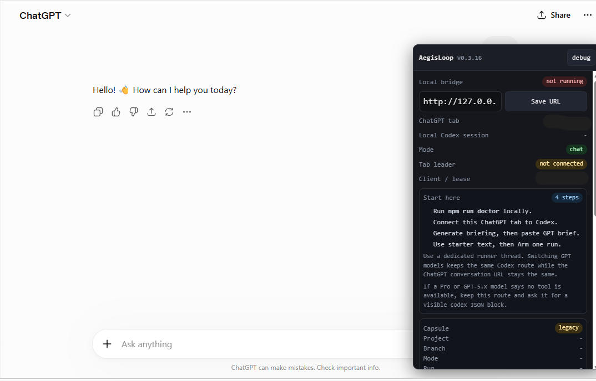
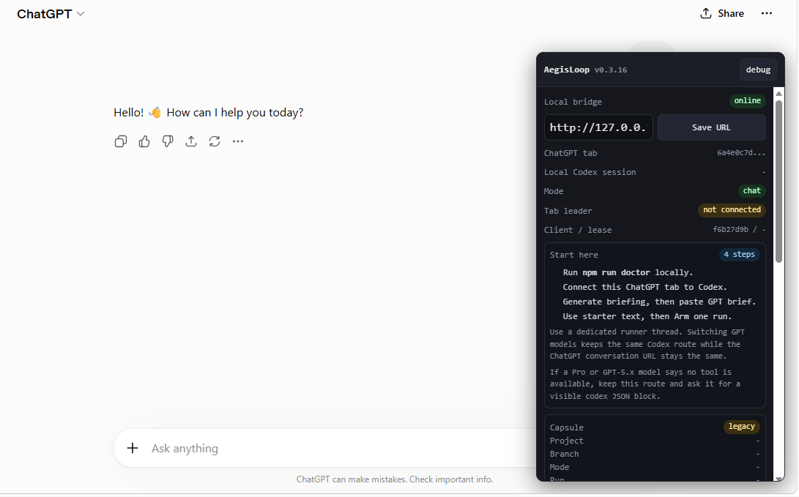

# Microsoft Edge Compatibility Smoke Report

## Environment

- OS: Windows 11
- Browser: Microsoft Edge (add the version from `edge://settings/help`)
- ChatGPT UI language: English
- AegisLoop version: 0.3.16
- Model mode tested: Chat

## Results

| Test                                         | Result                                                                       |
| -------------------------------------------- | ---------------------------------------------------------------------------- |
| Load unpacked extension                      | ✅ Pass                                                                      |
| Panel appears on chatgpt.com                 | ✅ Pass                                                                      |
| Chat Mode does not dispatch old Codex blocks | ✅ Pass (no old Codex JSON blocks observed during a simple chat interaction) |
| Local Bridge URL can be saved                | ✅ Pass                                                                      |
| Arm one run reaches waiting state            | ⚠️ Blocked                                                                   |

## Notes

The extension loaded successfully in Microsoft Edge and the panel rendered correctly on chatgpt.com.

The local bridge started successfully and reported:

```
[bridge] AegisLoop listening on http://127.0.0.1:17380
```

The "Arm one run" workflow could not be completed because the default example configuration still contains placeholder values for:

- conversationId
- codexSessionId
- workspaceDir

As a result, the ChatGPT tab remained "not connected", preventing the workflow from reaching the expected waiting state.

This appears to be a configuration prerequisite rather than an Edge compatibility issue.

## Screenshots



- Extension loaded in Edge



- AegisLoop panel visible on ChatGPT



- Local bridge online
